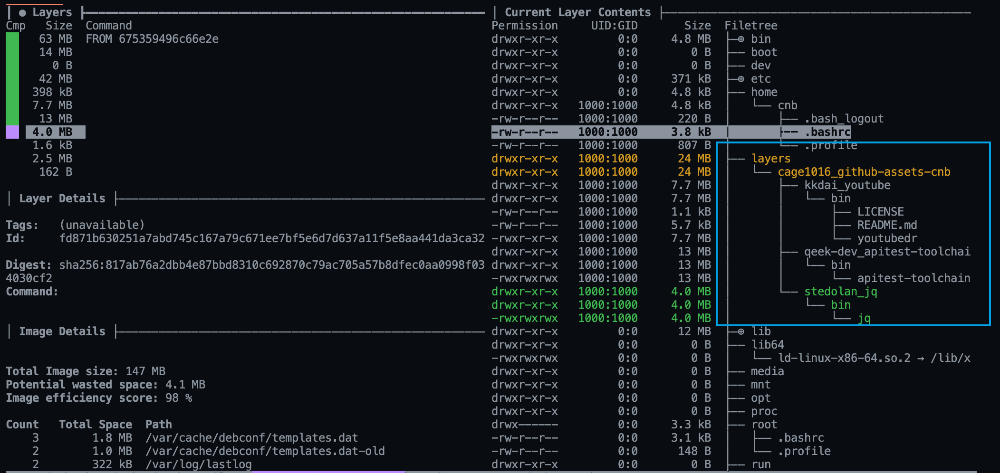

# Github Asset Buildpack


A [Cloud Native Buildpack](https://buildpacks.io) that Download Github Assets


## Buildpack registry

https://registry.buildpacks.io/buildpacks/cage1016/github-assets-cnb

## Features

- Support Download Public/Private Github Assets
- `x-tar`, `gzip`, `x-zx`, `zip` auto unarchive

## Usage

Support `metadata.githubassets` fields

- `repo`: Github Repo 
- `asset`: Github Repo asset name
- `tag`: Release tag name, default set to "latest"
- `token_env`: (optional), Please assign ENV name for private repo
- `destination`: download asset destination path to, `bin/<your-asset>` for `application/x-executable` asset
- `strip_components`: `x-tar`, `gzip`, `x-zx` suuport StripComponents feature.

1. Create `project.toml` if you want to embed github assets

    ```bash
    cat <<EOF >> project.toml
    # assign token
    [[build.env]]
    name = "APITEST_TOOLCHAIN_TOKEN"
    value = "<github-token>"

    [[metadata.githubassets]]
    repo = "kkdai/youtube"
    asset = "youtubedr_2.7.0_linux_arm64.tar.gz"
    destination = "bin"

    [[metadata.githubassets]]
    repo = "qeek-dev/apitest-toolchain"
    token_env = "APITEST_TOOLCHAIN_TOKEN"
    asset = "apitest-toolchain-linux-amd64"
    destination = "bin/apitest-toolchain"
    tag = "v0.1.0"

    [[metadata.githubassets]]
    repo = "stedolan/jq"
    asset = "jq-linux64"
    destination = "bin/jq"
    EOF
    ```

2. Build container image

    ```
    pack build myapp --buildpack cage1016/github-assets-cnb@2.1.0
    ```

3. Check `/layers/cage1016_github-assets-cnb`

    

### URI

```
urn:cnb:registry:cage1016/github-assets-cnb
```

### Supported Stacks

- google
- io.buildpacks.stacks.bionic
- io.paketo.stacks.tiny
- io.buildpacks.samples.stacks.bionic
- heroku-18
- heroku-20